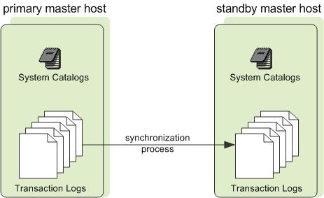

You can deploy a backup or mirror of the master instance on a separate host machine. The backup master instance, called the *standby master*, serves as a warm standby if the primary master becomes nonoperational. You create a standby master from the primary master while the primary is online.

When you enable master mirroring for an existing system, the primary master continues to provide service to users while a snapshot of the primary master instance is taken. While the snapshot is taken and deployed on the standby master, changes to the primary master are also recorded. After the snapshot has been deployed on the standby master, the standby master is synchronized and kept current using Write-Ahead Logging \(WAL\)-based streaming replication. Greenplum Database WAL replication uses the `walsender` and `walreceiver` replication processes. The `walsender` process is a primary master process. The `walreceiver` is a standby master process.

Since the master does not house user data, only system catalog tables are synchronized between the primary and standby masters. When these tables are updated, the replication logs that capture the changes are streamed to the standby master to keep it current with the primary. During WAL replication, all database modifications are written to replication logs before being applied, to ensure data integrity for any in-process operations.

This is how Greenplum Database handles a master failure.

-   If the primary master fails, the Greenplum Database system shuts down and the master replication process stops. The administrator runs the `gpactivatestandby` utility to have the standby master take over as the new primary master. Upon activation of the standby master, the replicated logs reconstruct the state of the primary master at the time of the last successfully committed transaction. The activated standby master then functions as the Greenplum Database master, accepting connections on the port specified when standby master was initialized. See [Recovering a Failed Master](g-recovering-a-failed-master.html).
-   If the standby master fails or becomes inaccessible while the primary master is active, the primary master tracks database changes in logs that are applied to the standby master when it is recovered.

These Greenplum Database system catalog tables contain mirroring and replication information.

-   The catalog table [gp\_segment\_configuration](../../../ref_guide/system_catalogs/gp_segment_configuration.html) contains the current configuration and state of primary and mirror segment instances and the master and standby master instance.
-   The catalog view [gp\_stat\_replication](../../../ref_guide/system_catalogs/gp_stat_replication.html) contains replication statistics of the `walsender` processes that are used for Greenplum Database master and segment mirroring.

**Parent topic:** [Overview of Greenplum Database High Availability](../../highavail/topics/g-overview-of-high-availability-in-greenplum-database.html)

